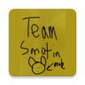

  

<h1 align="center">
  RoboticsRegister
</h1>

<h3 align="center">
  🤖 📄 :rocket:
</h3>

<h2>
  Team Σ-Motion 
</h2>

This app was built for [Team 2658](https://www.team2658.org/).

<h2>
  Tasks
</h2>

* Sends a generic email to the person who signed up.
* Saves all signups to a .csv file.
* Converts the .csv file to an excel file (just incase data is lost).
* All export files can be found in the downloads folder of the device.
* Is able to share with developer the excel files.

<h2>
  Downloads
</h2>

Download the apk [here](https://github.com/frc-emotion/RoboticsRegister/releases).
